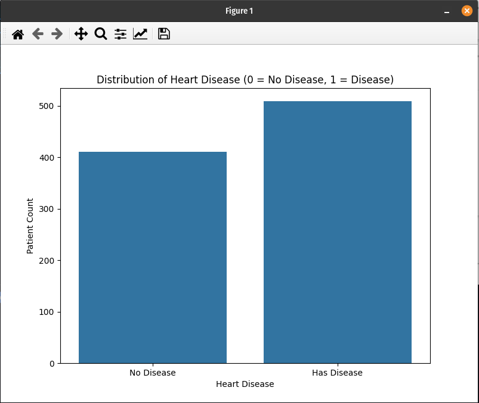
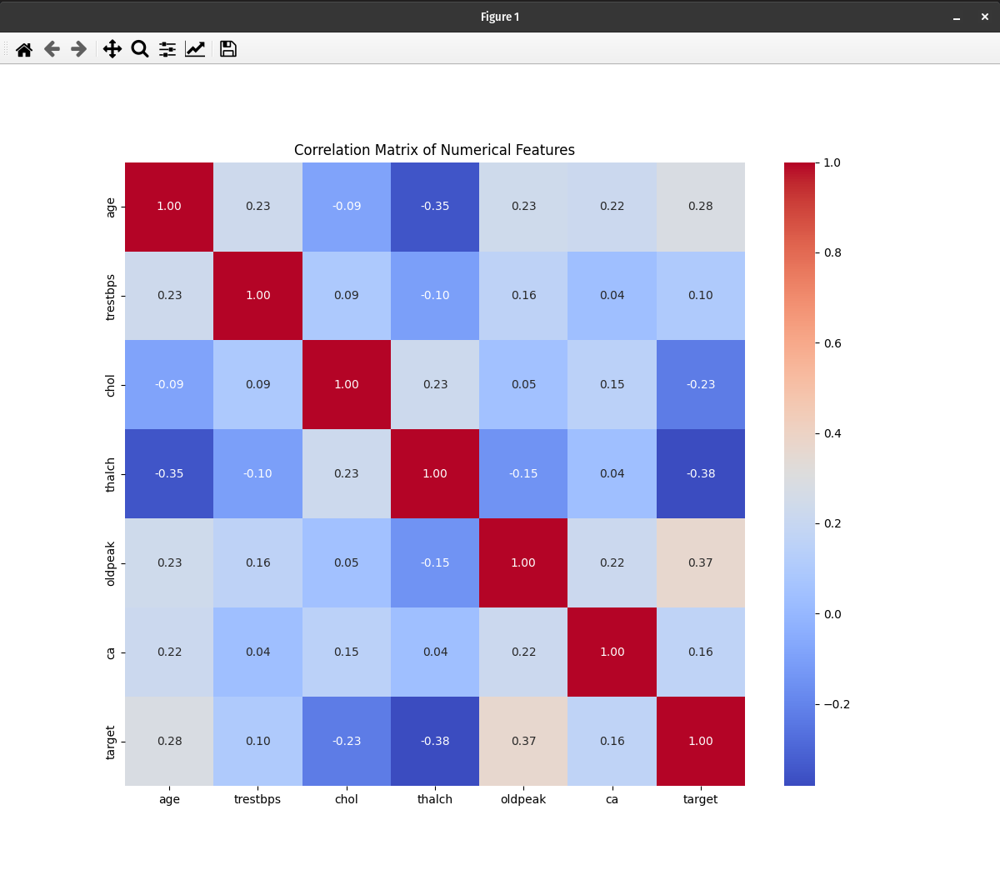
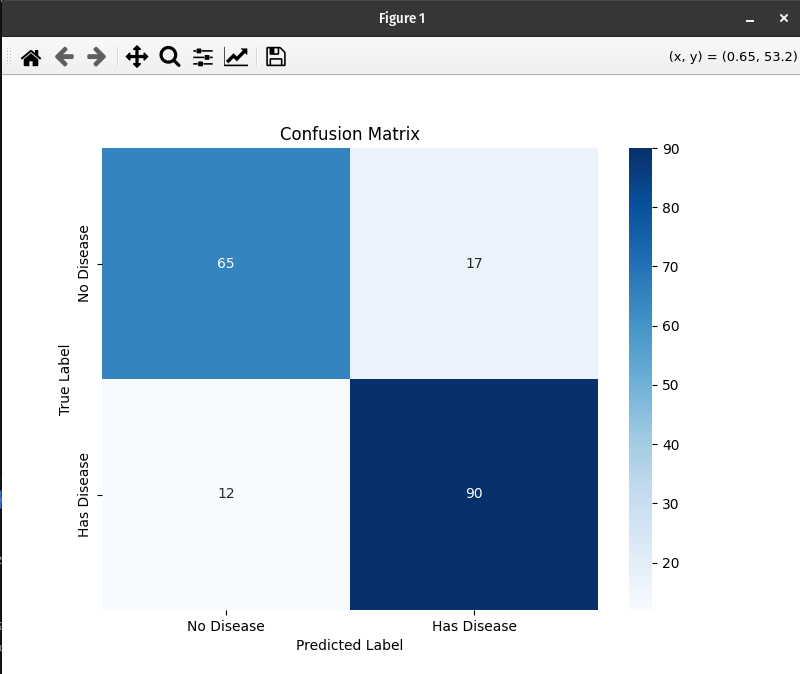

# Heart Disease Prediction Project

This project uses a classic machine learning approach to predict the presence of heart disease in patients based on a set of clinical features. The goal is to build a reliable classification model that can serve as a decision-support tool for medical professionals.

## 📋 Dataset

This project uses the Heart Disease UCI dataset, which is a well-known dataset in the machine learning community. It contains 14 clinical attributes collected from patients.

- **Source:** [Heart Disease UCI on Kaggle](https://www.kaggle.com/datasets/redwankarimsony/heart-disease-data)
- **File:** `heart_disease_uci.csv`

## ⚙️ Project Workflow

The project follows a standard machine learning pipeline:

- **Data Loading & Exploration:** The script begins by loading the dataset and performing an initial analysis to understand its structure, identify data types, and check for missing values.
- **Data Cleaning & Preprocessing:** This is a critical step to handle the "messy" real-world data.
  - **Feature Engineering:** The multi-class target variable (num) is converted into a binary target (target), where 0 represents no disease and 1 represents the presence of disease.
  - **Handling Missing Values:** Missing numerical data is filled using the median of each column, while missing categorical data is filled with the mode.
  - **Encoding Categorical Data:** All text-based features (e.g., sex, cp) are converted into a numerical format using one-hot encoding so the model can process them.
- **Model Preparation:**
  - **Train-Test Split:** The data is split into an 80% training set and a 20% testing set. The model learns from the training data and is evaluated on the unseen test data.
  - **Feature Scaling:** The features are standardized using StandardScaler to ensure that all variables are on a similar scale, which improves the performance of the Logistic Regression model.
- Model Training & Evaluation:
  - A Logistic Regression model is trained on the prepared data.
  - The model's performance is evaluated using several key metrics:
    - **Accuracy:** The overall percentage of correct predictions.
    - **Classification Report:** A detailed report including precision, recall, and f1-score.
    - **Confusion Matrix:** A table showing the breakdown of correct and incorrect predictions.

## 🚀 How to Run

- Prerequisites: Ensure you have Python and the following libraries installed:

  ```bash
  numpy
  scikit-learn
  matplotlib>=3.3.0
  pandas
  seaborn
  ```

  Create a Python virtual environment:

  ```bash
  python3 -m venv env
  ```

  Activate the Python virtual environment

  ```bash
  source /env/bin/activate
  ```

  Install all the libraries:

  ```bash
  pip3 install -r requirements.txt
  ```

- **Dataset:** Download the heart_disease_uci.csv file from the Kaggle link above and place it in the same directory as the Python script.

- **Execute:** Run the script from your terminal:

  ```bash
  python3 main.py
  ```

📊 Results

The script will output a detailed performance evaluation of the model. The Logistic Regression model achieves a **84.24%** accuracy in predicting the presence of heart disease. The Classification Report and Confusion Matrix provide a deeper insight into the model's effectiveness, particularly its ability to correctly identify patients with the disease (recall).

```bash
(env) maruf@mms:~/Documents/maruf-pfc/gub-cse-221/CSE-412 (Machine Learning Lab)/Project$ python3 main.py
First 5 rows of the dataset:
   id  age     sex    dataset               cp  trestbps   chol    fbs         restecg  thalch  exang  oldpeak        slope   ca               thal  num
0   1   63    Male  Cleveland   typical angina     145.0  233.0   True  lv hypertrophy   150.0  False      2.3  downsloping  0.0       fixed defect    0
1   2   67    Male  Cleveland     asymptomatic     160.0  286.0  False  lv hypertrophy   108.0   True      1.5         flat  3.0             normal    2
2   3   67    Male  Cleveland     asymptomatic     120.0  229.0  False  lv hypertrophy   129.0   True      2.6         flat  2.0  reversable defect    1
3   4   37    Male  Cleveland      non-anginal     130.0  250.0  False          normal   187.0  False      3.5  downsloping  0.0             normal    0
4   5   41  Female  Cleveland  atypical angina     130.0  204.0  False  lv hypertrophy   172.0  False      1.4    upsloping  0.0             normal    0

Dataset Information:
<class 'pandas.core.frame.DataFrame'>
RangeIndex: 920 entries, 0 to 919
Data columns (total 16 columns):
 #   Column    Non-Null Count  Dtype
---  ------    --------------  -----
 0   id        920 non-null    int64
 1   age       920 non-null    int64
 2   sex       920 non-null    object
 3   dataset   920 non-null    object
 4   cp        920 non-null    object
 5   trestbps  861 non-null    float64
 6   chol      890 non-null    float64
 7   fbs       830 non-null    object
 8   restecg   918 non-null    object
 9   thalch    865 non-null    float64
 10  exang     865 non-null    object
 11  oldpeak   858 non-null    float64
 12  slope     611 non-null    object
 13  ca        309 non-null    float64
 14  thal      434 non-null    object
 15  num       920 non-null    int64
dtypes: float64(5), int64(3), object(8)
memory usage: 115.1+ KB

Statistical Summary:
               id         age    trestbps        chol      thalch     oldpeak          ca         num
count  920.000000  920.000000  861.000000  890.000000  865.000000  858.000000  309.000000  920.000000
mean   460.500000   53.510870  132.132404  199.130337  137.545665    0.878788    0.676375    0.995652
std    265.725422    9.424685   19.066070  110.780810   25.926276    1.091226    0.935653    1.142693
min      1.000000   28.000000    0.000000    0.000000   60.000000   -2.600000    0.000000    0.000000
25%    230.750000   47.000000  120.000000  175.000000  120.000000    0.000000    0.000000    0.000000
50%    460.500000   54.000000  130.000000  223.000000  140.000000    0.500000    0.000000    1.000000
75%    690.250000   60.000000  140.000000  268.000000  157.000000    1.500000    1.000000    2.000000
max    920.000000   77.000000  200.000000  603.000000  202.000000    6.200000    3.000000    4.000000

Missing values in each column:
id            0
age           0
sex           0
dataset       0
cp            0
trestbps     59
chol         30
fbs          90
restecg       2
thalch       55
exang        55
oldpeak      62
slope       309
ca          611
thal        486
num           0
dtype: int64
Categorical Features
Index(['sex', 'cp', 'fbs', 'restecg', 'exang', 'slope', 'thal'], dtype='object')
Numerical Features
Index(['age', 'trestbps', 'chol', 'thalch', 'oldpeak', 'ca'], dtype='object')
Total missing values after cleaning: 0
Training set shape: (736, 18)
Testing set shape: (184, 18)
Model Accuracy: 84.24%

Classification Report:
              precision    recall  f1-score   support

           0       0.84      0.79      0.82        82
           1       0.84      0.88      0.86       102

    accuracy                           0.84       184
   macro avg       0.84      0.84      0.84       184
weighted avg       0.84      0.84      0.84       184


Confusion Matrix
[[65 17]
 [12 90]]
```

## Distribution of the target variable



## Correlation heatmap for numerical features



## Confusion Matrix Heatmap


